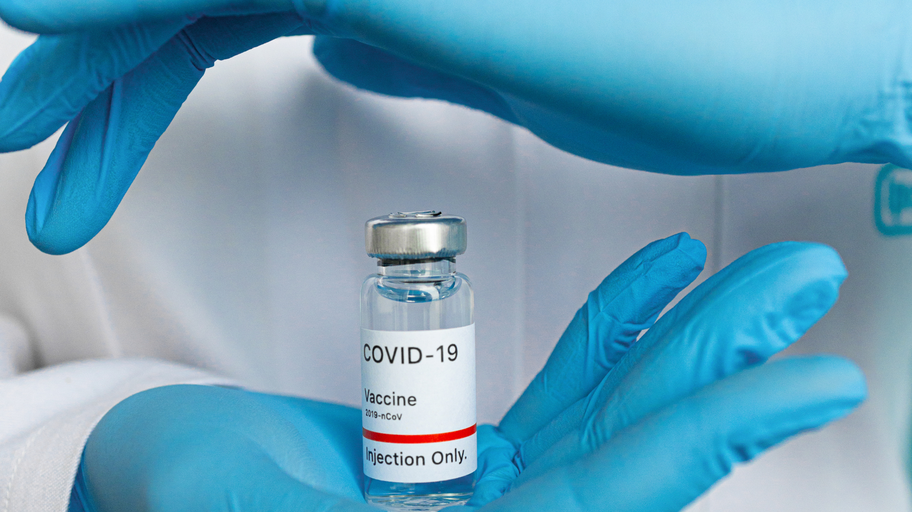

    

  

# Luiz Carlos
*Biólogo* Aspirante a analista de dados biológicos / Bioinformáta

Possui graduação em Ciências Biológicas e Mestrado em Ciências pelo Departamento de Biologia Celular e Molecular e Bioagentes Patogênicos.
Atuou como Técnico de Laboratório (Trainne) e Pesquisador (Mestrando) no Centro de Pesquisas em Virologia (USP).
Recentemente, atuou como Analista de Laboratório no controle de qualidade biológico, realizando testes de controle de qualidade de vacinas virais.

**Experiência em:** Biologia Celular e Molecular, Virologia, Python, Análise Exploratória de Dados, Pandas, Matplotlib.

**Links:**

* [LinkedIn](https://www.linkedin.com/in/luiz-carlos-vieira-4582797b/)

# Sobre este Projeto:

# Analisando dados de vacinação contra a covid-19 com SQL e python
### Autor: Luiz Carlos

## Introdução  

" Vacinação contra a Covid: Mais de 55% dos brasileiros estão parcialmente imunizados e mais de 25% completaram o esquema vacinal " 
    É comum encontrarmos noticiários com a manchete mencionada acima, a qual indica o status da vacinação no país. Contudo, por trás desses números relativamente pequenos, se escondem números incrivelmente altos. Se pararmos para analisar sobre os números absolutos das doses aplicadas em todo o Brasil, veremos que refletem o esforço e trabalho de muitos profissionais. 
    Até o momento desta análise, o Brasil se encontra na faixa de 200 milhões de doses aplicadas. No entanto, é provável que esse número já esteja desatualizado, devido a alta quantidade de doses aplicadas diariamente.  
    
## Objetivo da análise
   Este material tem o propósito de aprendizagem, com o intuito de colocar em prática conceitos sobre a linguagem SQL, Python e análise de dados.
Nesta análise serão respondidas questões como:
  * Número total de doses de vacinas aplicadas no Brasil?
  * Número total de doses de vacinas aplicadas nos estados brasileiros?
  * Número total da 1º doses de vacinas aplicadas?
  * Número total de pessoas completamente vacinadas no Brasil?
  * Relação de pessoas completamente vacinadas no Brasil x população de outros países.
  * Relação entre covid-19 e Vacinação.
  
## Considerações

Gostaria de deixar claro que a manchete será ideal ou ótima, quando: "Vacinação contra a Covid: 100% dos brasileiros estão completamente imunizados e nenhuma morte por covid tem sido registrada até o momento".  

O objetivo desta análise não apresenta nenhum viés político. Os dados sobre a vacinação foram analisados somente como forma de aplicação de conceitos e para sanar uma curiosidade a respeito dos números absolutos por trás da porcentagem mencionada nas manchetes.   

Aproveito para deixar o meu agradecimento a todos os cientistas, instituições de pesquisa e profissionais da saúde que estiveram ou estão envolvidos de alguma forma com a covid-19. O trabalho de vocês é e está sendo essencial no combate à pandemia. 

## Referências:  
https://realpython.com/python-mysql/  
https://www.w3schools.com/python/python_mysql_getstarted.asp  

#### Dados baixados dia 19/08/2021
https://covid.saude.gov.br/  
https://qsprod.saude.gov.br/extensions/DEMAS_C19Vacina/DEMAS_C19Vacina.html

